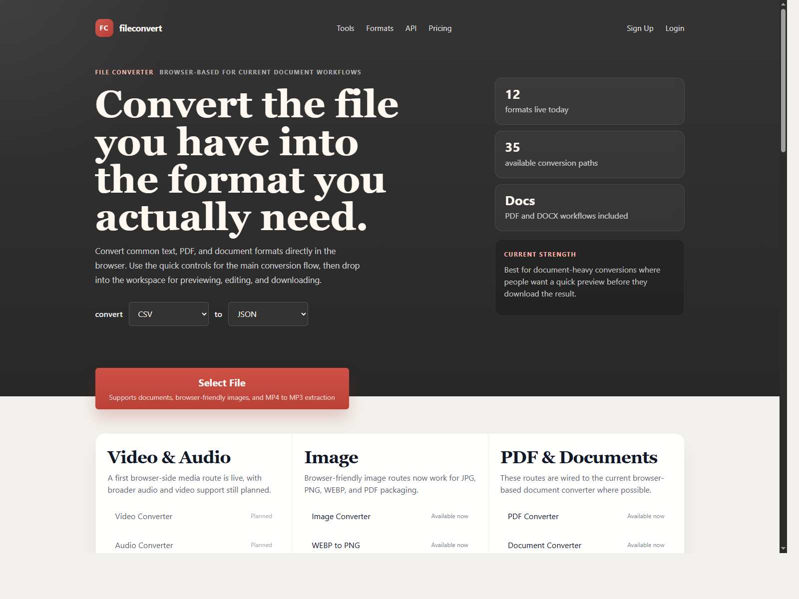

# Website-FileConverter

Browser-first file conversion app built with React and Vite. It supports document, image, text, and media conversion with live preview and downloadable output from one workspace.

Live demo:
[https://henrik-makeri.github.io/Website-FileConverter/](https://henrik-makeri.github.io/Website-FileConverter/)

Why I built this:
I wanted to make something real for my first project and have a finished website I could actually show people.

Small note:
The MP4 to MP3 part works, but bigger files can still feel a bit slow in the browser. I left it in anyway because it is useful, even if it is not perfect yet.

Key features:
- Convert CSV, JSON, Markdown, HTML, and plain text between multiple formats
- Parse DOCX uploads in the browser and export to TXT, HTML, Markdown, PDF, and DOCX workflows
- Extract text from text-based PDFs and convert to TXT, HTML, Markdown, or DOCX
- Convert browser-friendly images between JPG, PNG, WEBP, and PDF
- Extract MP3 audio from uploaded MP4 files in the browser
- Preview conversions before download and handle download and export client-side

Tech stack:
- React 19
- Vite
- `pdfjs-dist` for PDF parsing
- `mammoth` for DOCX extraction
- `docx` and `jspdf` for document export
- `lamejs` for MP3 encoding
